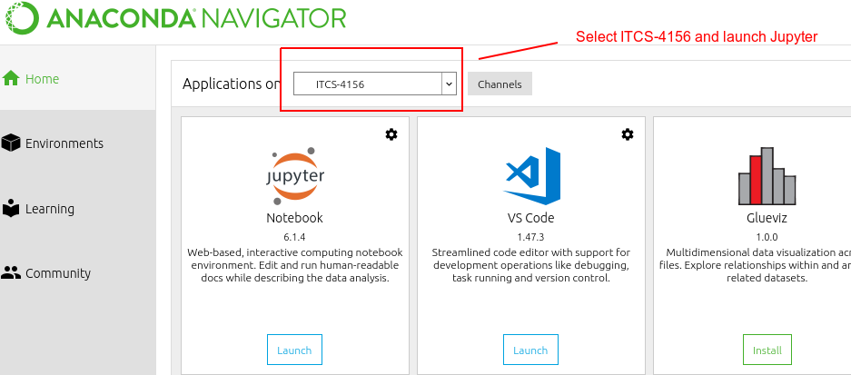
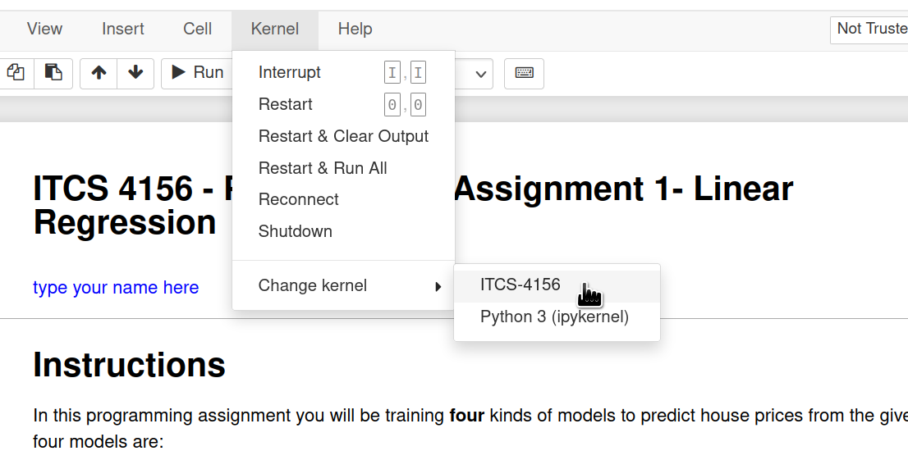
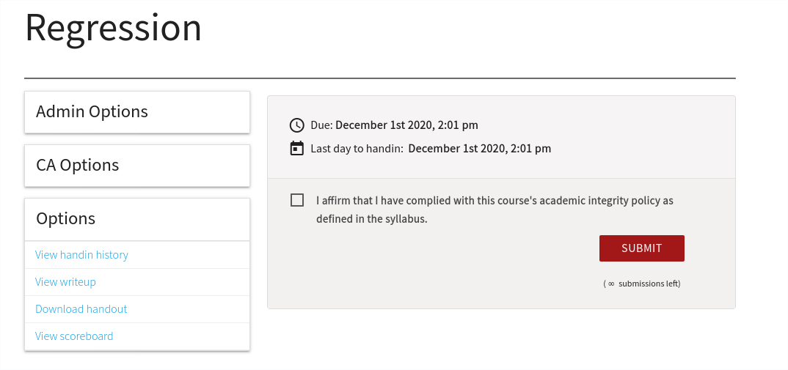

# ITCS 4156 - Mini-Project Instructions

Hello Everyone!

Below are the instructions for downloading, setting up, and submitting the mini programming assignments. There is a slight learning curve so take your time and go through this document carefully. If you have any questions feel free to ask!

## The Main Idea: 

- Your mini-projects will be auto-graded.

- You will see the majority of your final grade/score as soon as you submit your project to Autolab.

- You will have more than one submission. This allows you to improve your score, however only the <u>final</u> score is kept. The auto-grader will provide you with feedback on what's going wrong. Additionally, you will get an estimate of your score even before you submit the assignment. This will be made possible by providing you with an evaluation script to test your code locally on your computer.

- The evaluation script that runs locally only utilizes a validation set. When you submit your code to be auto-graded, an unseen test set will be used to evaluate your submission. That being said, the validation set should give you a good idea the score you'll receive on the test set.

- All projects are done with a combination of Jupyter Notebooks and Python scripts. You will need to submit the scripts for auto-grading and the notebook for manual grading. However, most of the points will come from the auto-grader. 

## The Work flow

Pull or download project from GitLab > Work locally in Notebook > Evaluate locally  > Evaluate in Autolab > Submit notebook to Canvas 

---

###  Downloading Assignment - GitLab

- This is a single repository which we will be using to publish all the programming assignments. 

    ```
    https://cci-git.uncc.edu/itcs4156/fall2021/mini-projects
    ```

- There are two ways to get this repository on your local machine. However, first we need to setup your Gitlab account.

### GitLab Setup

To be able to clone or access the mini-project repository, we will need to setup Two-Factor Authentication and create an access token. This is a one time procedure.

1. Go to https://cci-git.uncc.edu > *Click on your picture (top right)* > Settings > Account > Two-Factor Authentication > Enable (or Manage) > Register 2FA > *Scan the QR code with Duo Mobile App*.
    
2. Go to https://cci-git.uncc.edu > *Click on your picture (top right)* > Settings  > Access Tokens > Enter a name > Check **read_repository** > Create personal access token > *<u>Save this access token in a file for as you will not be able to access it again.</u> (This access token acts as your password when pulling updates from the repository.)*


#### (1) Easier but repetitive way
- When an assignment is published, you can use the download button (next to *Clone*) to get the latest code (which will have your assignment).

- If you do this for every assignment, you will end up with multiple versions of this repository on your machine (which is also okay).


#### (2) Requires setup but keeps all your code in one place method

- **Cloning The Repository**

    -  Next, you can clone the repository one time with the following command (this will get you the first assignment):

        ```bash
        git clone https://cci-git.uncc.edu/itcs4156/fall2021/mini-projects
        Cloning into 'mini-projects'...
        Username for 'https://cci-git.uncc.edu': username 	# uncc username eg: aparnami
        Password for 'https://username@cci-git.uncc.edu': 	# Right click and paste the access token
        ```
    - If you don't want to reenter your access token every time, you can have git save your password using the below command. **WARNING: This will save your password in plan text for you! DO NOT do this on a public computer!** The next time you enter your password it will be saved for the local repository only.

        ```bash
        git config credential.helper store
        ```

    - And whenever a new assignment is published you can do *git pull* in your directory to fetch it.

        ```bash
        git pull
        ```

---

### Setting up the assignment - Working Locally

- Once you have the repository on your machine, you will notice that it is structured in the following manner:

    ```
    | - itcs4156
        |- assignments              # This is where assignments will be pushed
        | - datasets                # Accompanying dataset for each assignment
        | - models                  # Base classes we'll inherit
        | - notebooks               # Accompanying notebooks
        | - util                    # Helper functions used across assignments
    | - setup.py
    | - README.md
    ```

- As the semester goes on new mini-projects will be added. By the end of the semester your repository should look like the following:

    ```
    | - itcs4156
        |- assignments              # This is where assignments will be pushed
            | - regression
            | - classification
            | - neural_networks
            | - deep_learning
        | - datasets                # Accompanying dataset for each assignment
        | - models                  # Base classes 
        | - notebooks               # Accompanying notebooks
            | - 1-regression
            | - 2-classification
            | - 3-neural-networks
            | - 4-deep-learning
        | - util                    # Helper functions used across assignments
    | - setup.py
    | - README.md
    ```

  - It is structured this way to separate **code** from **analysis**.  Each assignment will have two main components: 
    1. Project Notebook 
        - Located under `itcs4156/notebooks` directory.
        - This is the starting point of your assignment. 
        - Once you finish your work, you will submit the notebook on **Canvas**.
    2. Project Code and Scripts
        - Located under `itcs4156/assignments` directory.
        - The Jupyter notebook for the current mini-project will import these files. So your task is to write code in `.py` files and perform your data exploration and analysis in the notebook. Further, the notebook will walk you through which files to edit and when - one at a time. 
        - Once you complete a mini-project, you will need to **zip** just the project folder (eg. *itcs4156/assignments/regression* folder for 1st project) and submit it on **Autolab** for autograding.  

- **Setting up your assignment**

  - We will setup a conda environment *once* and activate it whenever we are working on the programming assignment. 

    ```bash
    conda create -n ITCS-4156 python=3.8
    ```

  - To activate the environment anytime in the command line do the following:

    ```bash
    activate ITCS-4156 			    # For WINDOWS
    source activate ITCS-4156 	# For Linux, macOS
    ```
    
  - Make sure you have *pip* 
    
      ```bash
      conda install pip
      ```
  
  - Now let's setup the assignment (make sure the environment is active).
    -  You'll have to execute the below pip install command once for every assignment incase new dependencies are added
  
    ```bash
    cd mini-projects
    pip install --user -r requirements.txt 	
    python setup.py develop --user
    ```
    
  - At this point, you are almost ready to begin your work. When you start Jupyter Notebook from the GUI be sure to select the `ITCS-4156` environment as seen in the below image.
  
  
  
  - If you aren't using the GUI, you'll have to install the environment in the Jupyter by doing the following. Once install you should be able to switch your kernel to use your conda environment in the notebook as seen in the below image.

    ```bash
    conda install ipykernel
    ipython kernel install --user --name=ITCS-4156
    ```
  
  
  - In the command line, to deactivate the environment (when you want to switch to another environment).
  
    ```bash
    deactivate            # Windows
    source deactivate	    # Linux, macOS   
    conda deactivate	    # This should also work
    ```
  
  - To delete the environment (in case you want to redo the setup).
    
      ```bash
      conda env remove --name ITCS-4156
      ```

---

### Submitting for Evaluation - Autolab

#### Signing in

- Autolab is an autograding server which has been setup for this course. 

- An account with your UNCC email has been setup. 

- For first time login - visit the following link to set your password (Enter your UNCC email):

  ```
  https://cci-autolab.uncc.edu/auth/users/password/new
  ```

- For subsequent logins, please visit

  ```
  https://cci-autolab.uncc.edu
  ```

#### Submitting
Once you are logged in, you can click on the current assignment. You will then proceed to a screen that looks something like the below image. Here you can submit your zipped assignment (details on how to zip your assignment are provided in each notebook for the corresponding project).



- First **check** the "I affirm that I have complied with this course's academic integrity policy as defined in the syllabus."

-  Click the **Submit** button to upload your assignment.

-  Click on **View scoreboard**  in  the "Options" section to setup your nickname and see your rank.

- Click on **View handin history** in  the "Options" section to see your submissions and the score. Clicking on the score will then take you to the auto grader's feedback and logging output.

#### Cheat Detection
Autolab uses a [Standfor'd Moss Cheat Detector](https://theory.stanford.edu/~aiken/moss/) which compares your submissions to every other students submission, including submissions from previous semesters. The cheat detection is ran after the project is due and will be used to scan everyone's submissions. Please DO NOT cheat! 

#### Submissions and Grading Information

- **Only final submission counts**
    - <u>The submission that will be graded will be your *last* submission. This means, submit your best results last!</u>

- **Grading and points**
    - For each project you will typically receive a total of ~80 points from the Autolab submission. You will receive points based on your accuracy, loss, or other performance measures. 
    - The remaining ~20 points comes from your ability to explore and analysis both the data and your results. In order to receive these 20 points, you must provide visualizations of your data and predictions while also including written explanations concerning your results. 

      - Refer to the data visualization, linear modeling, and polynomial labs for a reference - try to mimic the visualizations and results and the way they are talked about there first. Explanations should not only *explain* what you are observing in your visualizations and results but should also *explain why* you are seeing something and the potential *implications* of what you are seeing.
      
      - You don't have to be 100% correct, the goal is to see that you are actually thinking about the your results and visualizations.
      
      - If you think you lost points unfairly feel free to talk with the TA.

    - Each notebook will provide a breakdown of how many points are assigned and what scores you need to achieve the different point thresholds.

- **Extra Credit**
  - Those who make it in the **top 10** in the Autolab leader boards will be assigned 1 point of extra credit. There are 4 mini-projects so you can gain a total for 4 extra credit points throughout the semester. 

- **Too many submissions**
    - If too many student's submit to Autolab at once then the automatic grading can drastically slow down. With this in mind **DO NOT** wait until the last minute to submit to Autolab. 


---

### Notebook Submission - Canvas

- Each assignment has an associated notebook which needs to be submitted on **Canvas** to receive the final score. 
